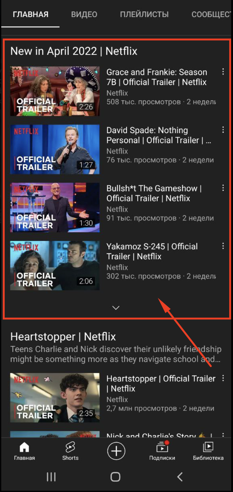

# Otus Plugin like YouTube

[](https://github.com/ivanartamonov/otus-plugin/actions/workflows/sanity-check.yml/badge.svg)

Плагин для создания виджета, который раздвигается вниз как в YouTube.



Виджет имеет заголовок и произвольное количество "карточек".


## Подключение

```html
<head>
  <!-- Include plugin files -->
  <link rel="stylesheet" href="slider.min.css">
  <script src="slider.min.js"></script>
</head>
<body>

<!-- Add Html markup -->
<div class="yt-slider">
  <div class="yt-title">Title</div>
  <div class="yt-entries">
    <div class="yt-entry">
      <!-- Some you content -->
    </div>
    <div class="yt-entry">
      <!-- Some you content -->
    </div>
    
    <!-- more entries... -->
  </div>
</div>

<!-- Init plugin -->
<script>
new Slider('.yt-slider', {
  visible: 3
})
</script>
</body>
```